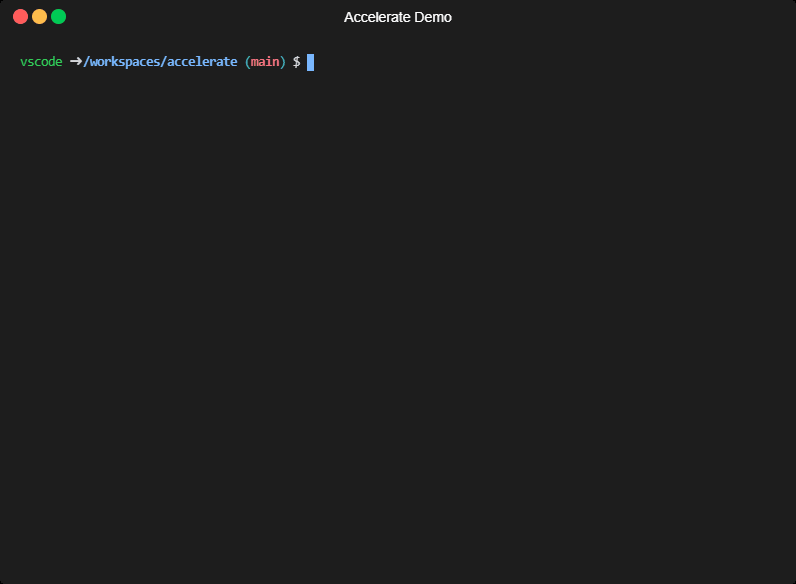

# Accelerate

Accelerate is a project inspired by [Skyscanner/turbolift](https://github.com/Skyscanner/turbolift), a great tool for managing changes across multiple GitHub repositories simultaneously. My shoutout and kudos to them for their incredible idea and work 💙. While Turbolift focuses on GitHub, Accelerate takes a similar concept but extends it to work with Azure DevOps repositories, with support for Windows, Linux, and macOS. Accelerate is designed to be flexible and open for future integration with other Git hosting platforms, ensuring it is not solely a tool for Azure DevOps.

> [!NOTE]
> Accelerate currently relies on Git. Please ensure Git is installed and configured to authenticate against your chosen Git hosting platform. In the future, we plan to replace the Git dependency with [Azure CLI DevOps](https://learn.microsoft.com/en-us/cli/azure/service-page/devops) to support an even broader range of use cases.

## Install the .NET Tool

    dotnet tool install --global Accelerate

## Basic Usage

Accelerate simplifies the workflow of making changes across multiple repositories into six steps:

1. Initialization — setting up
2. Identifying the repositories to operate on
3. Performing a mass clone of the repositories
4. Making changes in each repository
5. Committing changes to each repository
6. Creating a pull request for each repository

After initializing a new campaign using the command `dotnet accelerate init --name demo`, change the directory to the campaign by using the command `cd demo`. Then, add the repositories that require changes to the `repos.json` file. After cloning the repositories and making the necessary changes, commit them and push them to your Git hosting platform. Accelerate reads the pull request title and description from the campaign's `README.md`. Please ensure that you update the `README.md` before running finally the `dotnet accelerate create-prs` command.

> [!NOTE]
> To use Accelerate with Azure DevOps, you need to provide an access token that has the necessary permissions to create pull requests. Assign the generated access token to the environment variable `AZUREDEVOPSSETTINGS__AUTHTOKEN`. In the future, we will rely on the Azure CLI, and this token will no longer be necessary.

## Copyright

Copyright (c) 2024 Andre Hofmeister and other authors.